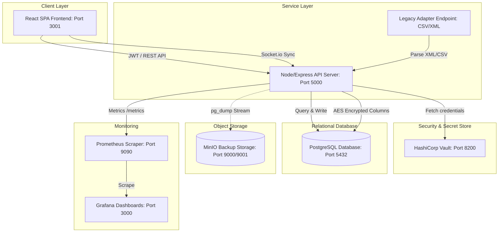

# National Healthcare Data Exchange Platform

### A Cloud-Native Academic DevOps Project (B.Tech CSE Semester IV DevOps Case Study)

---

## 1. Project Goal & Case Study Context
This platform simulates a secure nationwide network exchanging patient records among **Hospitals, Laboratories, Pharmacies, and Insurance Providers**. It is designed to satisfy critical DevOps principles: Containerization, CI/CD Pipeline Automation, Infrastructure as Code (IaC), Security Vault secrets manager, Symmetric Encryption at Rest, Real-time WebSockets Sync, and System Monitoring.

---

## 2. AWS → Open-Source Tooling Mapping

To run this platform on a single development laptop, AWS resources have been mapped to self-hostable equivalents:

| Original (AWS-based) requirement | Replacement used here | Why it satisfies the requirement |
|---|---|---|
| **AWS EKS** (Kubernetes orchestration) | **Minikube** (local Kubernetes cluster) | Orchestrates container life cycles using standard manifests (namespaces, deploy, svc, ingress, HPA, RBAC). |
| **AWS RDS** (managed Postgres) | **PostgreSQL** container / StatefulSet | Runs the relational database engine, persisted with persistent storage claims. |
| **AWS S3** (object storage for backups) | **MinIO** | Implements the identical S3-API specs, serving as the local disaster recovery repository. |
| **AWS IAM** (identity & access mgmt) | **JWT + RBAC API Middleware** & **K8s RBAC** | Enforces credentials authentication and role clearance (hospital, lab, pharmacy, insurance, admin). |
| **AWS API Gateway** | **NGINX Reverse Proxy / Ingress** | Routes, rewrites, and secures ingress paths. |
| **AWS CloudWatch** | **Prometheus + Grafana** | Scrapes process variables and visualizes system status metrics. |

---

## 3. High-Level Architecture Diagram



---

## 4. Repository Structure

```
healthcare-exchange-platform/
├── frontend/                  # React App
├── backend/                   # Node/Express API with pg, socket.io, metrics
├── infra/
│   ├── k8s/                   # Kubernetes manifests
│   ├── terraform/             # Terraform configs (Kubernetes provider)
│   └── jenkins/               # Jenkinsfile + run notes
├── monitoring/
│   ├── prometheus/            # Prometheus scraping configurations
│   └── grafana/               # Pre-provisioned Grafana dashboards
├── security/
│   └── vault/                 # Vault setup instructions
├── scripts/                   # backup.sh (pg_dump -> MinIO) and DB utilities
├── docs/                      # Technical documentation
├── Jenkinsfile                # Declarative Jenkins CI/CD pipeline
└── docker-compose.yml         # Main orchestrator for local environment
```

---

## 5. Quick Start: Local Deployment via Docker Compose

Run the entire platform including databases, security vaults, monitoring scrapers, and pipeline containers with a single command:

```bash
docker compose up -d --build
```

### Verification
Once launched, verify service ports are active on your browser:
- **React Frontend**: [http://localhost:3001](http://localhost:3001)
- **Node API Metrics**: [http://localhost:5000/metrics](http://localhost:5000/metrics)
- **Prometheus Dashboard**: [http://localhost:9090](http://localhost:9090)
- **Grafana Server**: [http://localhost:3000](http://localhost:3000) (User/Pass: `admin` / `admin`)
- **MinIO Console**: [http://localhost:9001](http://localhost:9001) (User/Pass: `minioadmin` / `minioadmin`)
- **HashiCorp Vault**: [http://localhost:8200](http://localhost:8200) (Root token: `root`)
- **Jenkins Controller**: [http://localhost:8080](http://localhost:8080)

---

## 6. Security & Credentials Integration (Vault Setup)

By default, the backend falls back to `.env` variables if Vault is not populated. To integrate Vault during your live viva:
1. Navigate to the Vault UI: [http://localhost:8200](http://localhost:8200) and sign in using token `root`.
2. Click **Create Engine** -> **KV (Key-Value)**. Set the path to `secret`.
3. Create a secret named `healthcare`. Add the following key-value pairs:
   - `db_user` = `postgres`
   - `db_password` = `postgres`
   - `jwt_secret` = `healthcare_secret_key_jwt_12345`
4. Restart the backend container (`docker compose restart backend`). It will connect to Vault and load these credentials dynamically at boot.

---

## 7. Automated Infrastructure deployment (Terraform)

To deploy the namespace, services, configmaps, and secrets to a local Minikube cluster using Terraform:

1. Launch Minikube:
   ```bash
   minikube start
   ```
2. Navigate to the Terraform directory:
   ```bash
   cd infra/terraform
   ```
3. Initialize and deploy:
   ```bash
   terraform init
   terraform apply -var="kube_config_path=~/.kube/config" --auto-approve
   ```
4. Verify the resources are running inside Minikube:
   ```bash
   kubectl get all -n healthcare-platform
   ```

---

## 8. Manual Kubernetes Deployment (kubectl)

Alternatively, deploy using the prebuilt sequential script:

```bash
cd infra/k8s
chmod +x deploy.sh
./deploy.sh
```

---

## 9. Centralized Monitoring & Metrics (Prometheus + Grafana)

- **API Metrics**: The API server exposes custom variables under `/metrics` via `prom-client`.
- **Preconfigured Dashboard**: Grafana automatically imports the datasource and UI layouts from [dashboard.json](file:///Users/shwetashetty/Documents/HealthCare-Platform/monitoring/grafana/dashboards/dashboard.json). Log in to Grafana and open the "National Healthcare Exchange Dashboard" to inspect request latency and memory allocations.

---

## 10. Disaster Recovery Demonstration (MinIO Backup)

Execute the disaster recovery script to capture a live SQL dump of the database and upload it directly to the MinIO backups bucket:

```bash
./scripts/backup.sh
```

Navigate to MinIO Console -> Buckets -> `backups` to download or inspect the SQL dump files.

---
