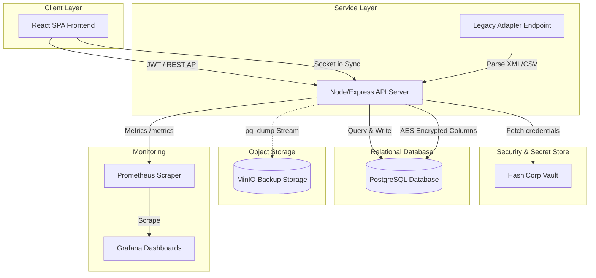

# Architecture Overview - National Healthcare Data Exchange Platform

This document describes the high-level design of the cloud-native, open-source National Healthcare Data Exchange Platform.

## System Topology & Data Flow

## Core Architectural Modules

1. **Frontend Client (React SPA)**: Served using Nginx in containers. Distributes role-based views (Hospital Staff, Lab Tech, Pharmacist, Insurance Agent, Admin).
2. **Backend API (Node.js/Express)**: Exposes endpoints, handles request validation, executes authorization checks using JWT tokens and Role-Based Access Control (RBAC) middleware, and emits real-time updates via Socket.io.
3. **Database (PostgreSQL)**: Persists schemas for clinical, billing, and system audit logging.
4. **Secrets Manager (HashiCorp Vault)**: Isolates database passwords and JWT signing keys, exposing them dynamically to the backend at boot.
5. **Real-time Event Broker (Socket.io)**: Synchronizes user interface states automatically when mutations occur in the exchange database.
6. **Object Storage (MinIO)**: S3-compatible local bucket storage acting as the disaster recovery backup registry.
7. **Scraper & Monitoring Engine (Prometheus & Grafana)**: Polls metric indicators (latencies, counts) from the API `/metrics` endpoint.
